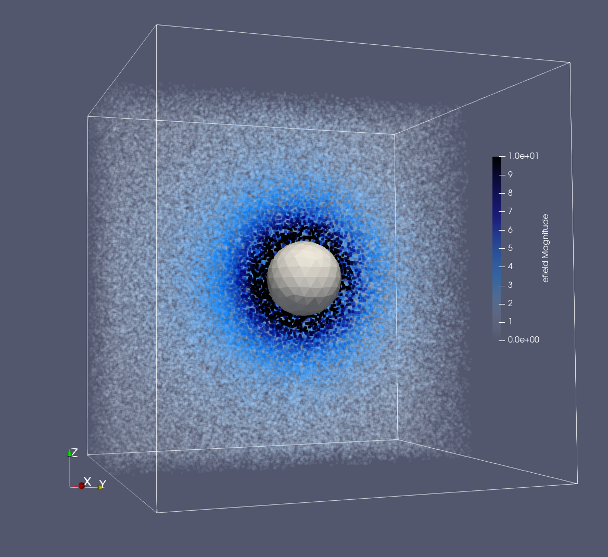
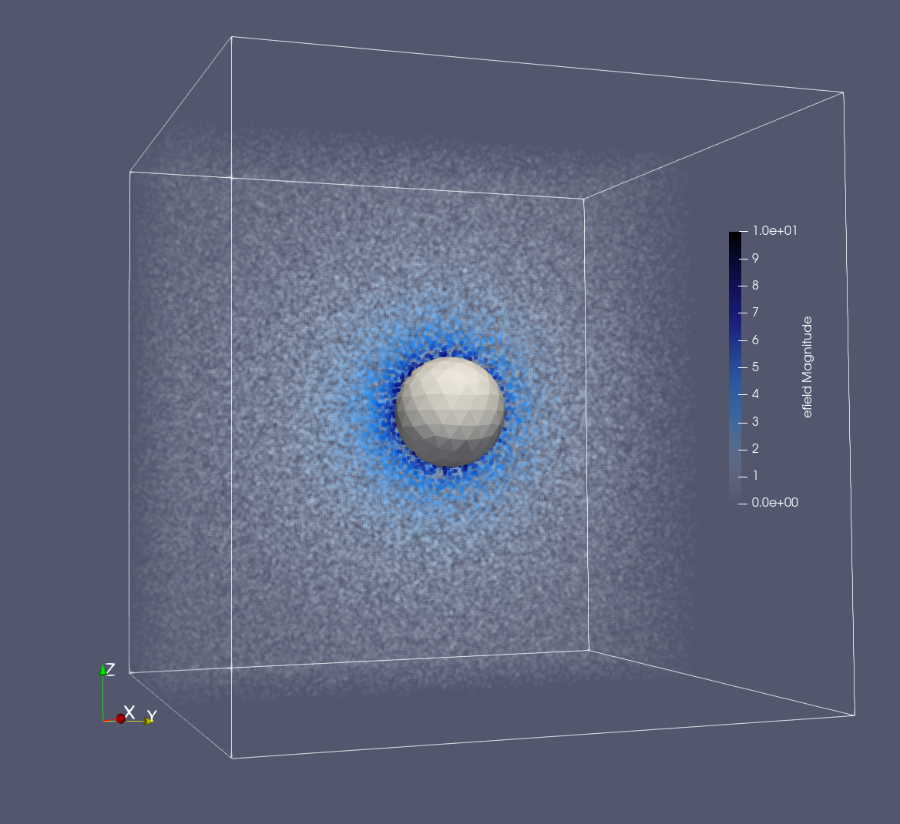
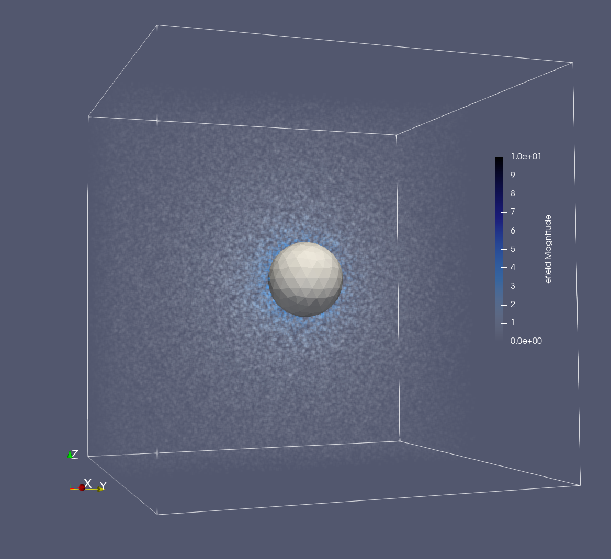
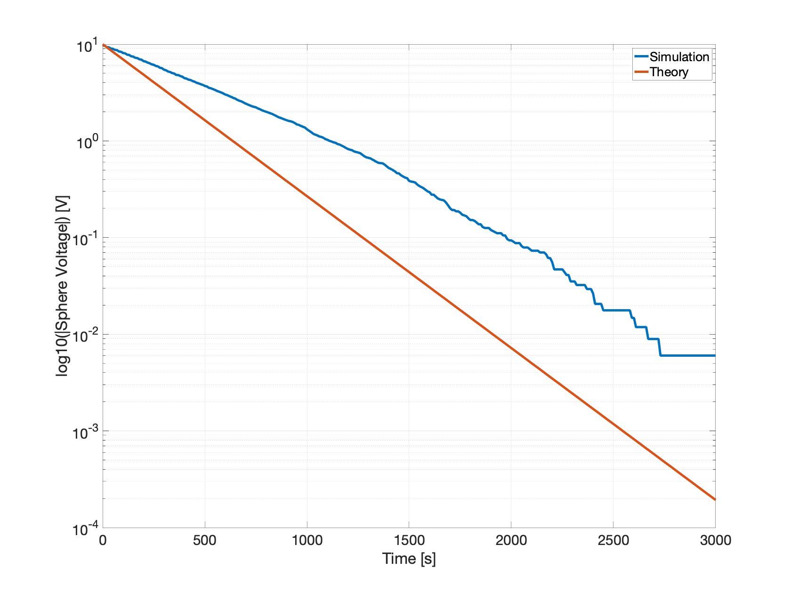

Unipolar relaxation
===================

Problem Statement
-----------------

Consider an initially uncharged conducting sphere placed in a uniform, cold, unipolar ion bath.
After a while we bias the sphere to a polarity opposite that of the ions, and then immediately disconnect it, leaving the sphere floating at an attractive nonzero potential.
The resulting unipolar current can be derived from the electric field

.. math::
	:nowrap:

	\begin{eqnarray}
		E_r=\frac{Q}{4 \pi \varepsilon_0 r^2}
	\end{eqnarray}

and the definition of mobility

.. math::
	:nowrap:

	\begin{eqnarray}
		\vec{v} = \mu \vec{E}
	\end{eqnarray}

to get

.. math::
	:nowrap:

	\begin{eqnarray}
		I = n q v_r A = n q \cdot \mu E_r \cdot 4 \pi R^2
	\end{eqnarray}

where :math:`n` is ion concentration, :math:`q` is ion charge, and :math:`R` is radius of the sphere. This yields the differential equation for charge on the sphere

.. math::
	:nowrap:

	\begin{eqnarray}
		\dot{Q}=n q \mu \cdot \frac{Q}{4 \pi \varepsilon_0 R^2} \cdot 4 \pi R^2=Q \frac{n q \mu}{\varepsilon_0}
	\end{eqnarray}

Converting :math:`Q` to :math:`V` using the definition of capacitance 

.. math::
	:nowrap:

	\begin{eqnarray}
		C V = Q
	\end{eqnarray}

and noting that

.. math::
	:nowrap:

	\begin{eqnarray}
		\sigma = n  |q|  \mu
	\end{eqnarray}

the solution is

.. math::
	:nowrap:

	\begin{eqnarray}
		V(t) = V_0 \exp\left(-\frac{t}{\varepsilon_0/\sigma}\right)
	\end{eqnarray}

The negative sign in the exponential comes from the sign of :math:`q` relative to :math:`V_0`.

Numerical Validation
--------------------

Runs simulating the relaxation phenomenon for a conducting sphere can be found in ``dragion/runs/sphere``.

Initially, positive unipolar ions are loaded uniformly into the domain, with concentration :math:`n=\sqrt{\frac{q}{\alpha}}=2\times10^9 \: \mathrm{m}^{-3}` [Lorenz, MMRTG], and a sphere of radius :math:`R=0.5 \mathrm{m}` is biased to :math:`-10 \mathrm{V}` then left floating.
Note: this simulation does not include a uniform background source or collisional sink.

The resulting time-progression is illustrated by a sequence of 3D screenshots:

- :math:`t=0 \mathrm{s}`

- :math:`t=500 \mathrm{s}`

- :math:`t=1000 \mathrm{s}`

As the sphere collects nearby ions its (negative) charge level and electric field strength diminish.
The voltage drop is exponential, and its slope (in log-voltage) can be used to back out an estimate of atmospheric conductivity, :math:`\sigma = \mathrm{slope} \cdot \varepsilon_0`.

Here is a plot of (log10) voltage over time:

Notice that overall the **dragion** sphere relaxes more slowly than predicted by theory.
However, there is a slight inflection in the simulated voltage at :math:`t=1200 \mathrm{s}`.
A comparison of slopes before and after this knee, and the full end-to-end slope provide estimates for conductivity, using :math:`\sigma = \mathrm{slope} \cdot \varepsilon_0`:

+-------------------------------------+----------------------------------------------------+--------------------------------------------------+
| Fit                                 | Slope (relaxation rate) :math:`[\mathrm{s}^{-1}]`  | :math:`\sigma [\mathrm{S}/\mathrm{m}]`           |
+=====================================+====================================================+==================================================+
| End-to-end                          | -0.0011                                            | :math:`0.95\times10^{-14}`                       |
|                                     |                                                    |                                                  |
| Before :math:`t=1200 \: \mathrm{s}` | -0.0009                                            | :math:`0.79\times10^{-14}`                       |
|                                     |                                                    |                                                  |
| After :math:`t=1200 \:\mathrm{s}`   | -0.0013                                            | :math:`1.2\times10^{-14}`                        |
+-------------------------------------+----------------------------------------------------+--------------------------------------------------+
| Theoretical                         | -0.0016                                            | :math:`1.4\times10^{-14}`                        |
+-------------------------------------+----------------------------------------------------+--------------------------------------------------+

*More discussion is needed. Why is there an inflection point? It is probably related to domain shape and size. Why is the late-time estimate the best?*

At very late times the near-surface ion concentration will be depleted, so without a background source charging will eventually halt. In this regime the assumption of steady near-surface concentration would be violated and the theoretical model breaks down.

