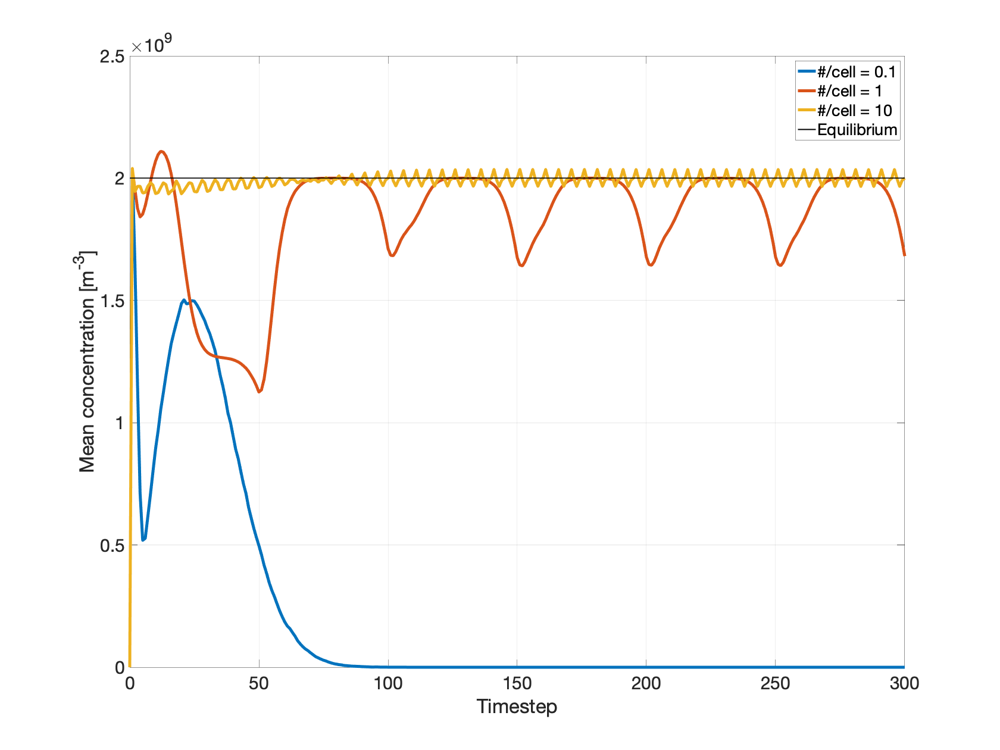

Unipolar ions: uniform source and loss
======================================

Problem Statement
-----------------

The bipolar balance equation (in the absence of aerosol particles) is

.. math::
	:nowrap:

	\begin{eqnarray}
		\frac{\mathrm{d}n_+}{\mathrm{d}t} = q - \alpha n_+ n_- \\
		\frac{\mathrm{d}n_-}{\mathrm{d}t} = q - \alpha n_+ n_-
	\end{eqnarray}

where :math:`n_\pm` are respective ion concentrations and :math:`\alpha\sim10^{-12} \: \mathrm{m}^3 \: \mathrm{s}^{-1}` [Harrison and Tammet]. Sans aerosols, :math:`n_+=n_-`, so that a single species reads

.. math::
	:nowrap:

	\begin{eqnarray}
		\frac{\mathrm{d}n}{\mathrm{d}t} = q - \alpha n^2
	\end{eqnarray}

**dragion** can be tested against this unipolar balance equation with a uniform ``VolumeSource`` and ``CollisionalSinkUnipolar``; the implementation is in ``dragion/simulations/unipolar/sourcesinktest/SourceSinkTest.java``.

The ``VolumeSource`` uniformly distributes particles across the simulation ``Box`` at a steady rate, representing the constant source term :math:`q`.

The ``CollisionalSinkUnipolar`` algorithm simulates the loss term :math:`- \alpha n^2` by overlaying a uniform grid on the simulation domain, and at each timestep

(1) computing :math:`n^2` in each grid cell
(2) removing :math:`n^2 \: \alpha \: \mathrm{d}t \: \mathrm{d}^3r \: / \: np2c` macroparticles per grid cell (leaving zero if exceeding the existing number)

We would expect the simulated :math:`\frac{\mathrm{d}n}{\mathrm{d}t}` to equal :math:`0`, integrated over many timesteps; in other words, the simulated concentration should be constant, with ion production in numerical balance with loss.

Numerical Validation
--------------------

Taking :math:`q = 4 \times 10^6 \: \mathrm{m}^{-3} \: \mathrm{s}^{-1}` and :math:`\mathrm{d}n/\mathrm{d}t = 0` yields a theoretical steady-state unipolar concentration of :math:`n_{equil}=\sqrt{q / \alpha = 2 \times 10^9 \: \mathrm{m}^{-3}` [Lorenz, MMRTG].

The ``SourceSinkTest`` starts with an empty 5 m simulation box. The ``VolumeSource`` fills the domain with macroparticles, until the ion concentration reaches :math:`n_{equil}` and the ``CollisionalSinkUnipolar`` removes as many ions as are added, on average.

Crucial simulation parameters are the macroparticle "size", controlled by :math:`np2c`, and the grid spacing used for particle-particle collisions. For this numerical experiment the collision cell-size is the domain length divided by 64.

At :math:`np2c=10^7` the mean concentration peaks rapidly but proceeds to fall off unphysically: the number of macroparticles per grid-cell is far too low, with cell size / particle size ratio :math:=`(5 \mathrm{m}/64)^3/(n_{equil}/np2c) = 0.1`.

Reducing :math:`np2c` by two orders of magnitude increases the # particles per grid cell to :math:`\sim 10`, and the expected steady-state concentration is recovered, with small oscillations about the mean.

